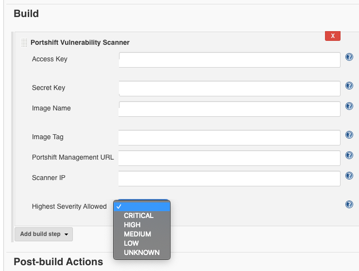

# Portshift Jenkins CI Plugin #

This plugin for Jenkins enables you to scan docker images for vulnerabilities in Jenkins, and report results to the Portshift server.

## Operational prerequisites for the plugin  ##

1. Docker must be installed on the same machine as Jenkins. If your job is configured to use a node other than the Master node, then Docker is required only on the build Jenkins node (slave). 
2. A *jenkins* user must be added to the *docker* group, with permission to run Docker:

     ```
     sudo usermod -aG docker jenkins
     ```
## Install and configure the plugin
1. In Jenkins, select **Manage Jenkins** and then select **Manage Plugins** from the list. Ensure that the list of available plugins is up to date. 
2. Select the **Available** tab, search for Portshift Vulnerability Scanner, and select it.  Click on **Download the Plugin**. This will install the plugin.


## Use the plugin
You can use the plugin in the build process in Freestyle and Pipelines jobs. You can configure the job to scan the image during the build process.

### Freestyle jobs

For Freestyle jobs, add a build step to scan the image with Portshift, as part of the job configuration. 
1. In Jenkins, in the **Configure** page for a job, click **Add Build Step**.
2. Select **Portshift Vulnerability Scanner**.


3. Enter the image name.
4. Enter the access key and secret key for the Portshift *Service* user.
5. Enter the external IP of your Jenkins runner as *scanner-ip*.
6. Enter the URL of the Portshift server (*console.portshift.io* in most cases)

### Pipeline jobs
For Pipeline jobs, the build step to scan the image with Portshift is included in a pipeline script, as part of the job configuration.

1. In Jenkins, in the **Configure** page for a job, scroll to the **Pipeline** section.
1. Add a snippet, such as the following, to the pipeline script, to include a step to scan the image. 


### Build control based on Severity level

You can set a maximum permitted severity level for the image. If vulnerabilities are found in the image that exceed this level, the build will fail. 
If the value is not set, there are no restrictions (the build will not be failed).

Select the level in the build stage:




## Plugin output

You can see the results of the scan in the Console Output.


You can also see results of the scan as an HTML page. An artifact named *scanResults.html* is created in the project workspace. In the Jenkins build menu, select Portshift Vulnerability Scanner, and then select the job whose results you wish to see.


## Build the plugin (instructions for Ubuntu)

* If JDK is not installed, install it
```
     sudo apt-get update
     sudo apt-get install openjdk-8-jdk
```

* Install Maven3 (must be 3)

*  Build

   When in the root directory, where *pom.xml* resides:
```
     mvn package
```
   **Note**: the first time this command is invoked, many downloads will occur and it will take  some time.


## Publicly release a new version to jenkins-ci.org ##
See https://wiki.jenkins-ci.org/display/JENKINS/Hosting+Plugins#HostingPlugins-Releasingtojenkinsci.org. It describes several alternatives; use the following:

1. If not already done, create a *settings.xml* file with your credentials, as described.
2. Run the following, and accept defaults for all prompts:
```
    mvn release:prepare release:perform
````
